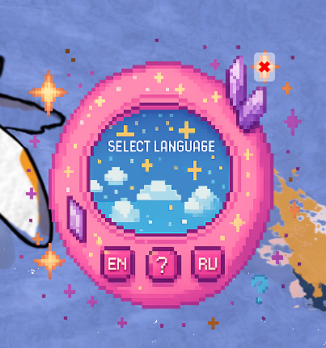
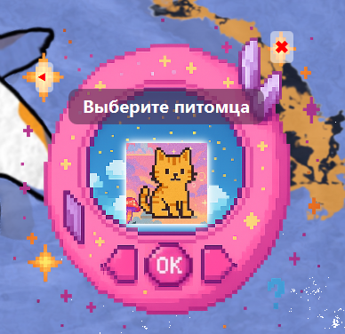
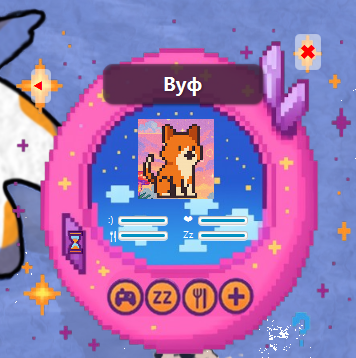
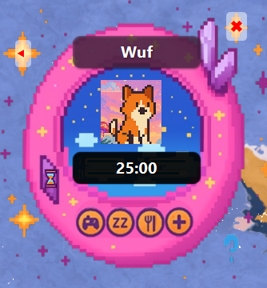

<h1 align="center">🐾 Tamagotchi JavaFX Game</h1>

<p align="center">
  Virtual pet desktop game with JavaFX GUI, animations, multilingual support, save system, and a Pomodoro mini-window.<br>
  Fully written in Java as part of my personal and study projects.
</p>

<p align="center">
  
</p>

---

<h2 align="center">📖 About the Project</h2>

<p align="center">
  This is a <strong>JavaFX-based Tamagotchi game</strong> developed as a personal and study project.<br>
  No console interface — <strong>fully GUI-controlled</strong> with draggable windows and styled buttons.
</p>

---

<h2 align="center">🎮 Main Features</h2>

<p align="center">
  🐾 Pet Selection: Dog, Cat, Bird, Fish (with name validation)<br>
  🌐 Language Menu: EN / RU<br>
  💖 Pet Status Management: mood, hunger, energy (live updates)<br>
  💾 Save System: pet state saved between sessions<br>
  ⏰ Pomodoro Window: mini focus window with timer<br>
  🎛️ Main Menu: start screen before entering the game<br>
  🔊 Audio Support: working sound effects with JavaFX Media<br>
  ⏳ Timer Presets: choose focus duration before starting<br>
  ⏯️ Pause & Resume: control sessions without losing progress<br>
  🎨 Custom Styling: draggable window, styled UI elements
</p>


---

<h2 align="center">🛠️ Tech Stack</h2>

<p align="center">
  Java 17 • JavaFX • Maven • FXML • CSS Styling • Custom Icons, Sounds, and Images
</p>

---

<h2 align="center">🚀 How to Run</h2>

<p align="center">
  Java 17+ and JavaFX SDK required<br><br>
</p>

```bash
mvn clean javafx:run
```


<h2 align="center">📸 Screenshots</h2> <p align="center">  
   
  


</p>
  
<h2 align="center">👩‍💻 About Me</h2> <p align="center"> <strong>Alena Vodopianova</strong><br> Mobile Software Development student @ FH Joanneum Graz 🇦🇹<br><br> <a href="mailto:alonsoy75@gmail.com">📫 Email</a> • <a href="https://www.linkedin.com/in/alena-vodopianova-723b32b0/">🔗 LinkedIn</a> </p>
<p align="center"> Created with ☕, JavaFX, and pure pet-loving energy 💻🐾 </p> 


